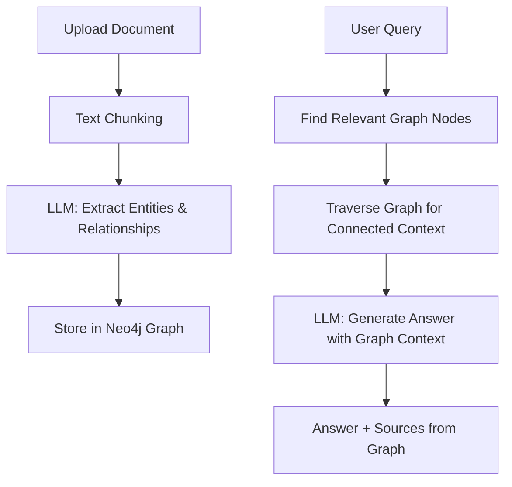

#  Upgrading GraphRAG from Mock → Real System

## Current State (Weak)
Your `/ask` endpoint just returns:
```python
return QueryResponse(
    answer=f"Simulated GraphRAG response for: {request.query}",
    sources=["Document A", "Graph Node B"]
)
```
This won't survive a single interview question. Let's fix that.

---

## What a Real GraphRAG System Does



### Two Main Flows:

**1. Ingestion (Build the Knowledge Graph)**
- User uploads a document (text/PDF)
- System chunks it into paragraphs
- LLM extracts entities (people, orgs, concepts) and relationships from each chunk
- Entities & relationships stored as nodes & edges in Neo4j

**2. Query (Graph-Enhanced RAG)**
- User asks a question
- System finds relevant entities in the graph (keyword + embedding match)
- Traverses the graph to pull in connected context (this is what makes it *Graph*RAG, not just RAG)
- LLM generates an answer using the graph context as evidence
- Returns answer + source entities/relationships

---

## LLM Provider Options

| Provider | Free Tier | Cost | Recommendation |
|----------|-----------|------|----------------|
| **Google Gemini API** | 15 RPM free | $0 for demo usage |  Best for you |
| **OpenAI API** | No free tier | ~$0.01-0.03 per query |  Works but costs |
| **Groq (Llama 3)** | 30 RPM free | $0 for demo usage |  Also great |
| **Ollama (local)** | Unlimited | $0 but needs RAM |  t3.small too weak |

> [!TIP]
> **Google Gemini** or **Groq** give you free API calls — perfect for demos without burning credits.

---

## Proposed API Endpoints

| Method | Endpoint | What It Does |
|--------|----------|--------------|
| `GET` | `/health` | Health check + Neo4j status |
| `POST` | `/ingest` | Upload a document → extract entities → build graph |
| `POST` | `/ask` | Ask a question → graph-enhanced retrieval → LLM answer |
| `GET` | `/graph/stats` | Show graph size (nodes, edges, entity types) |
| `GET` | `/graph/entities` | List all entities in the knowledge graph |
| `GET` | `/graph/search/{term}` | Search entities by name |

---

## Proposed File Structure

```
graphrag-devops-project/
├── main.py                 # FastAPI app with all endpoints
├── app/
│   ├── __init__.py
│   ├── graph_rag.py        # Core GraphRAG logic
│   ├── entity_extractor.py # LLM-based entity/relationship extraction
│   ├── graph_store.py      # Neo4j operations (CRUD for entities/relations)
│   ├── retriever.py        # Graph-enhanced retrieval logic
│   └── models.py           # Pydantic data models
├── sample_data/
│   └── sample_document.txt # Pre-loaded sample for demos
├── Dockerfile
├── docker-compose.yml
├── requirements.txt
├── terraform/
└── k8s/
```

---

## What Makes This Impressive in an AI/ML Interview

1. **Entity Extraction** — You're using an LLM to do NER + relation extraction (NLP skill)
2. **Knowledge Graphs** — You understand graph data structures and Neo4j/Cypher (data engineering)
3. **RAG Architecture** — You know retrieval-augmented generation (core GenAI concept)
4. **Graph Traversal** — Your retrieval goes beyond simple vector search by walking relationships (advanced RAG)
5. **Production Deployment** — It's not a notebook; it's a deployed, monitored, CI/CD-automated service

---

## Decision Needed

**Which LLM provider do you want to use?**

1. **Google Gemini** — Free, you probably already have a Google account
2. **Groq** — Free, very fast (runs Llama 3)
3. **OpenAI** — Best quality but costs money

Pick one and I'll build the real GraphRAG system before we proceed with deployment.
